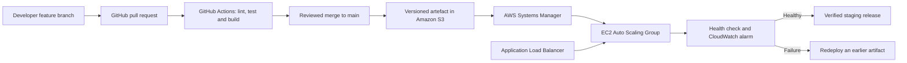

# B8IT122 Cloud Infrastructure and Virtualisation

Individual continuous integration and continuous deployment (CI/CD) project by Diana Thomsen.

This repository demonstrates an AWS based CI/CD pipeline using GitHub Actions, Terraform and AWS Systems Manager. It provisions cloud infrastructure, runs automated checks, packages a small demonstration workload and deploys it to a staging environment. An optional CodeDeploy design is retained for accounts that support the service.

The web service is not intended to be a complete product. Its purpose is to provide visible evidence that a source-code change can pass through build, test and deployment stages before appearing in the live staging environment.

## Project objectives

- Provision an AWS Virtual Private Cloud (VPC) using Terraform.
- Separate public and private network tiers.
- Use Git feature branches and pull requests.
- Run syntax checks and automated tests for every pull request.
- Build an immutable deployment artefact.
- Deploy approved changes to staging with AWS Systems Manager.
- Validate application health after deployment.
- Stop a failed deployment and retain earlier artifact versions for manual rollback.
- Provide centralised monitoring and deployment notifications.

## Architecture



The Terraform configuration creates two public and two private subnets across two Availability Zones. The load balancer is internet-facing, while the EC2 workload is placed in private subnets and accepts application traffic only from the load balancer. Systems Manager is used for administrative access, so inbound SSH is not required.

## Repository structure

```text
.
├── .github/workflows/       GitHub Actions CI/CD workflow
├── deploy/                  AWS CodeDeploy lifecycle scripts
├── docs/                    Project details and captured evidence
├── infrastructure/terraform AWS infrastructure definitions
├── public/                  Demonstration page
├── scripts/                 Local lint and build scripts
├── src/                     Node.js demonstration service
├── test/                    Automated service tests
├── appspec.yml              AWS CodeDeploy deployment specification
└── package.json             Node.js commands and project metadata
```

## Pipeline behaviour

Pull requests targeting `main` run the quality and infrastructure-validation jobs. A merge or direct push to `main` repeats those checks. The resulting revision deploys to the protected `staging` environment only when `ENABLE_STAGING_DEPLOY` is set to `true`. The workflow can also be started manually after the paused capacity is restored.

The main stages are:

1. Check out the selected Git revision.
2. Check JavaScript syntax.
3. Run automated tests.
4. Package the application and CodeDeploy hooks into a ZIP artefact.
5. Format and validate the Terraform configuration.
6. Authenticate to AWS using GitHub OpenID Connect (OIDC).
7. Upload the immutable revision to the versioned S3 bucket.
8. Send a deployment command through AWS Systems Manager.
9. Wait for Systems Manager to report success.
10. Run a final HTTP health check against staging.

Long-lived AWS access keys are not stored in GitHub. The workflow exchanges GitHub's OIDC token for short-lived AWS credentials scoped to the deployment role.

## Run locally

Node.js 20 or later and the `zip` command are required.

```bash
npm ci
npm run check
npm start
```

Open `http://localhost:3000` after starting the service. The health endpoint is available at `http://localhost:3000/health`.

During the live demonstration, edit the sentence in `src/demo-message.js`, commit the change and open a pull request. After the checks pass and the change is merged, the revised sentence should appear on staging.

## AWS prerequisites

- An active AWS account with sufficient credits.
- AWS CLI and Terraform 1.6 or later.
- A GitHub repository containing this project.
- Permission to create VPC, EC2, IAM, S3, CloudWatch, SNS, Auto Scaling, Elastic Load Balancing and CodeDeploy resources.
- A confirmed AWS Budgets notification email is recommended for cost control.

The reference configuration uses the `eu-west-1` region. Copy the example variables before provisioning:

```bash
cd infrastructure/terraform
cp terraform.tfvars.example terraform.tfvars
terraform init
terraform fmt -check -recursive
terraform validate
terraform plan -out=staging.tfplan
terraform apply staging.tfplan
```

Review the plan carefully before applying it. Terraform may create chargeable resources, including a NAT Gateway, Application Load Balancer and EC2 instance.

## GitHub staging configuration

After Terraform completes, add the following variables to the GitHub `staging` environment:

| Variable | Source |
|---|---|
| `AWS_REGION` | `eu-west-1` or the selected Terraform region |
| `AWS_ROLE_ARN` | Terraform output `github_actions_role_arn` |
| `ARTIFACT_BUCKET` | Terraform output `artifact_bucket` |
| `INSTANCE_TAG_NAME` | `b8it122-demo-staging-app` |
| `STAGING_URL` | Terraform output `application_url` |
| `ENABLE_STAGING_DEPLOY` | Set to `true` only while staging capacity is active |

Configure the `staging` environment with an approval rule if the GitHub plan supports it. This separates successful integration from authorised deployment.

## Monitoring and rollback

The load balancer checks `/health` on each application instance. Systems Manager also executes `deploy/validate.sh` before the workflow marks the revision successful. A CloudWatch unhealthy host alarm sends a notification through Amazon SNS. The artifact bucket retains versioned packages so the workflow can redeploy a previous known good revision when required.

Deployment status is available through the GitHub Actions run and Systems Manager command history. Detailed service output is available in the instance service journal through Systems Manager. A CloudWatch log group is provisioned for centralised application logging as a documented extension to the demonstration environment.

## Cost control and cleanup

This is a temporary educational environment. Keep it deployed only while testing or collecting presentation evidence. Destroy the infrastructure after the demonstration:

```bash
cd infrastructure/terraform
terraform plan -destroy
terraform destroy
```

Confirm in the AWS console that the NAT Gateway, load balancer, EC2 instances and unattached public IPv4 addresses have been removed. Retain screenshots and deployment records required for the technical report before cleanup.

## Terminology note

The assessment details require a VPC and identify subnets, route tables, an internet gateway and security groups. A later marking table uses the phrase “VPN Architecture.” This implementation treats that wording as a reference to the required VPC architecture because no remote network or site-to-site VPN endpoint is defined in the scenario.

## References

- Amazon Web Services (n.d.) *AWS CodeDeploy User Guide*. Available at: https://docs.aws.amazon.com/codedeploy/latest/userguide/welcome.html (Accessed: 4 August 2026).
- Amazon Web Services (n.d.) *Amazon VPC User Guide*. Available at: https://docs.aws.amazon.com/vpc/latest/userguide/what-is-amazon-vpc.html (Accessed: 4 August 2026).
- GitHub (n.d.) *Configuring OpenID Connect in Amazon Web Services*. Available at: https://docs.github.com/actions/security-for-github-actions/security-hardening-your-deployments/configuring-openid-connect-in-amazon-web-services (Accessed: 4 August 2026).
- HashiCorp (n.d.) *Terraform documentation*. Available at: https://developer.hashicorp.com/terraform/docs (Accessed: 4 August 2026).
